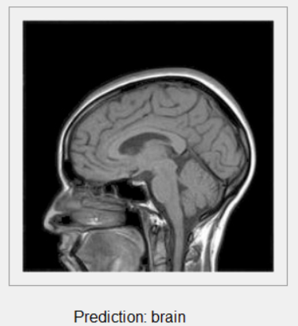
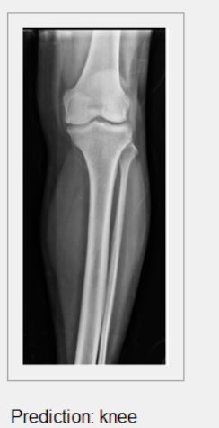
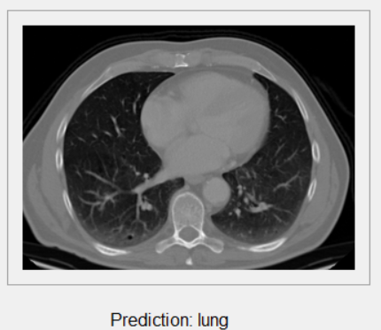
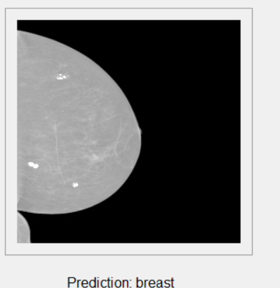

# Medical Image Classifier

This project is a **Medical Image Classifier** built using Python, TensorFlow, and Tkinter. It provides a graphical user interface (GUI) to upload medical images and classify them into predefined categories.

## Features

- Upload medical images in various formats (e.g., PNG, JPG, JPEG, GIF, BMP, TIFF).
- Predicts the category of the uploaded image (e.g., brain, breast, knee, lung).
- Displays the prediction result with confidence percentage.
- Easy-to-use GUI built with Tkinter.

## Features

- Upload medical images in various formats (e.g., PNG, JPG, JPEG, GIF, BMP, TIFF).
- Predicts the category of the uploaded image (e.g., brain, breast, knee, lung).
- Displays the prediction result with confidence percentage.
- Easy-to-use GUI built with Tkinter.

## Requirements

Before running the application, ensure you have the following dependencies installed:

- Python 3.7+
- TensorFlow
- Pillow
- Numpy

## Installation

1. Clone the repository or download the code.
2. Install the required Python packages using pip:

   ```bash
   pip install tensorflow pillow numpy
   ```

3. Ensure you have the trained model file `newnew.h5` located at `C:/Users/ahmed/OneDrive/Desktop/task2/newnew.h5`. Update the path in the code if needed.

## Usage

1. Run the application using the following command:

   ```bash
   python <filename>.py
   ```

2. A GUI window will open.
3. Click on the "Upload Image" button to upload a medical image.
4. View the predicted category and confidence percentage displayed below the image.

## Code Overview

### Main Components

1. **`MedicalImageClassifier` Class**
   - Initializes the GUI and loads the pre-trained model.
   - Handles image upload and prediction.

2. **Key Methods**
   - `create_widgets()`: Creates the GUI components.
   - `preprocess_image(image)`: Preprocesses the image for model input (resize, grayscale conversion, etc.).
   - `upload_image()`: Handles the file selection dialog and prediction logic.

3. **Model**
   - The pre-trained model (`newnew.h5`) is loaded using TensorFlow's `load_model()` method.
   - The model predicts one of four predefined categories: `brain`, `breast`, `knee`, `lung`.

## File Structure

```plaintext
.
├── <filename>.py         # Main application code
├── newnew.h5             # Pre-trained model file (ensure it exists at the specified path)
```

## Screenshots










## Customization

- To modify the model or categories:
  - Update the `self.preds` list in the `MedicalImageClassifier` class to reflect the new categories.
  - Replace the `newnew.h5` file with your custom trained model.

## License

This project is open-source. You can modify and use it as per your requirements.

